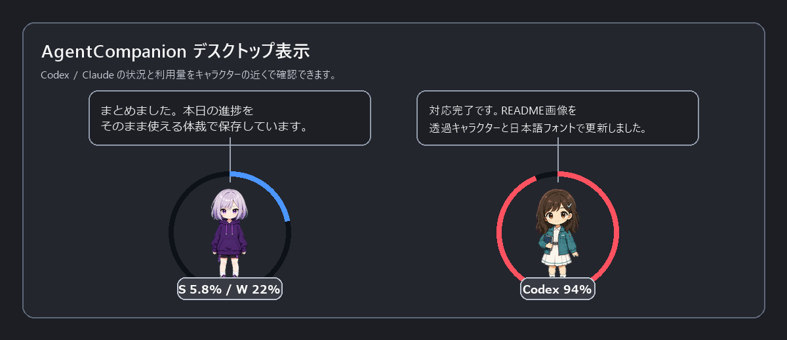
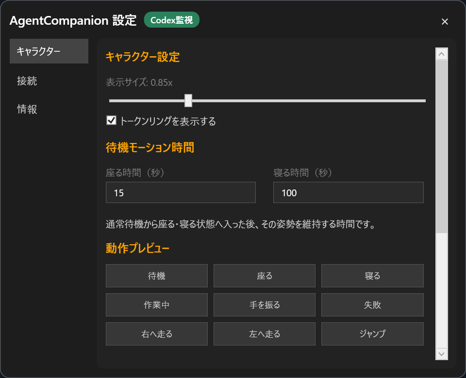
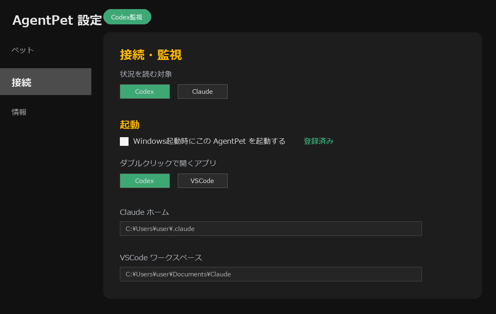

# AgentCompanion

[](https://github.com/k-hattori-itcs/agent-companion/releases/latest)
[](https://github.com/k-hattori-itcs/agent-companion/actions/workflows/build.yml)

AgentCompanion は、デスクトップ上のキャラクターが Codex / Claude の実行状況と利用量を知らせる Windows 常駐アプリです。

元プロジェクト [sugar301/TokenPet](https://github.com/sugar301/TokenPet) をベースに、Codex と Claude Code のローカル履歴監視、常時トークンリング表示、アプリ起動/前面表示、複数キャラクター切替を追加したカスタム版です。

## 画面イメージ

spritesheet から切り出した キャラクタープレビューを使った公開用の画面イメージです。キャラクターの吹き出し、トークンリング、Codex / Claude の利用量表示を同時に確認できます。



設定画面イメージです。キャラクターの見た目、動作プレビュー、監視対象、起動設定を切り替えられます。





## 主な機能

- Codex の最新タスク状況を吹き出しに表示
- Claude Code の最新セッション状況を吹き出しに表示
- Codex / Claude の利用量を キャラクター周囲のリングで常時表示
- Claude は短期枠と週間枠の2重リング表示に対応
- AIの状態に応じて作業中・完了・エラーのキャラクター動作を切替
- キャラクターをドラッグして移動
- ダブルクリックで Codex または VSCode を起動/前面表示
- Koharu / Luna のキャラクター切替
- タスクトレイから表示/非表示、設定、終了を操作
- 設定画面から Windows スタートアップ登録/解除

## キャラクターの動作

Koharu の実際のspritesheetから切り出した静止プレビューです。動作プレビュー名は設定画面のボタン名と対応しています。

| 状況 | 動作プレビュー名 | Koharu | アニメーション |
| --- | --- | --- | --- |
| 通常待機 | 待機 |  | idle |
| 通常待機が続いたとき（既定15秒間） | 座る |  | sit |
| 座るを2回繰り返した後の長めの待機（既定100秒間） | 寝る |  | sleep |
| AI が処理中 | 作業中 |  | sprint |
| AI が入力・承認待ち | 座る |  | sit |
| AI の作業完了 | 手を振る |  | wave |
| AI のエラー検知 | 失敗 |  | fail |
| キャラクターをドラッグ中 | 右へ走る / 左へ走る |   | walk / run_left |
| ドラッグ終了 | ジャンプ |  | jump |

一覧画像は [Koharu の動作一覧](docs/assets/koharu-states/koharu-state-overview.png) にあります。

座る・寝る状態を維持する時間は、設定画面の `キャラクター` -> `待機モーション時間` で変更できます。

## 動作環境

- Windows 10 / 11
- GitHub Actions の配布artifactを使う場合、.NET Runtime の別途インストールは不要
- ソースからビルドする場合は .NET 8 SDK

## 使い方

1. `AgentCompanion.exe` を起動します。
2. タスクトレイの AgentCompanion アイコンを右クリックして `設定` を開きます。
3. `接続` タブで `状況を読む対象` を `Codex` または `Claude` に設定します。
4. `ダブルクリックで開くアプリ` を `Codex` または `VSCode` に設定します。
5. 必要に応じて `Windows起動時にこの AgentCompanion を起動する` を有効にします。
6. Claude を監視する場合は `Claude ホーム` と `VSCode ワークスペース` を確認します。

詳しい手順は [SETUP.md](./SETUP.md) を参照してください。

## 操作

| 操作 | 動作 |
| --- | --- |
| 左ドラッグ | キャラクターを移動 |
| ダブルクリック | Codex / VSCode を開く、または前面に表示 |
| タスクトレイ右クリック | 表示/非表示、設定、終了 |
| `AgentCompanion.exe --settings` | 設定画面を直接開いて起動 |
| 終了後の再起動 | 配置したフォルダの `AgentCompanion.exe` をもう一度実行 |


## 起動とスタートアップ

AgentCompanion はインストーラーを前提にしていません。任意のフォルダに publish 出力を置き、`AgentCompanion.exe` を実行します。

終了した後にもう一度使う場合は、AgentCompanion を配置したフォルダの `AgentCompanion.exe` を再実行してください。タスクトレイから `終了` した場合も同じです。

Windows 起動時に自動起動したい場合は、`設定` -> `接続` -> `Windows起動時にこの AgentCompanion を起動する` を有効にします。登録は現在のユーザーだけに適用され、アプリフォルダ単位で管理されます。

## Codex / Claude の違い

AgentCompanion は1つのアプリです。設定ファイル `pet_data/pet_config.json` の `StatusProvider` と `LauncherTarget` によって、Codex / Claude などの接続プロファイルを切り替えます。

2つを同時に使う場合は、アプリフォルダを `AgentCompanion-Codex` と `AgentCompanion-Claude` のように2つに分けてください。フォルダ名は任意です。各フォルダがそれぞれ独立した `pet_data` を持つため、接続先プロファイルとキャラクターの見た目を別々に設定できます。

### Claude 監視の前提と制限

Claude 監視は、VSCode 内で動く Claude Code CLI が出力するローカル履歴を対象にしています。状況表示は `Claude ホーム` 配下の `projects/**/*.jsonl` を読みます。利用量リングは、Claude Code のOAuth認証を使ってAnthropicの利用状況APIから5時間枠・週間枠を取得します。

利用率の優先順位:

1. Claude Code OAuthによる利用状況APIの実値
2. `~/.claude/agentcompanion-rate-limits.json` に保存されたClaude Code statuslineの値（旧名 `agentpet-rate-limits.json` も移行用に読み取り）
3. ローカルJSONLからの推定値（`5h~` / `W~` と表示）

制限:

- Claude Web、Claude Desktop、VSCode拡張の独自UIだけの作業状態は直接監視しません。ただし、Claude Codeと共有される契約利用率は利用状況APIの値に含まれます。
- Claude Code CLI の履歴JSONLが書かれない環境では、状況の吹き出しは更新されません。
- 利用状況APIはClaude Codeが使用する非公開エンドポイントのため、Claude Code側の変更で取得できなくなる可能性があります。その場合はstatusline値またはJSONL推定へ自動的に切り替わります。
- API取得にはClaude Codeが `Claude.ai` のOAuthでログイン済みである必要があります。認証トークンは表示・複製・保存・ログ出力しません。
- `Claude ホーム` や `VSCode ワークスペース` が既定と違う場合は、設定画面で明示してください。

## キャラクターについて

標準で次のキャラクターを同梱しています。

- Koharu
- Luna

キャラクターは設定画面の `キャラクター` タブから追加できます。キャラクターパッケージは ZIP 形式で、ZIP の直下に `pet.json` と `spritesheet.webp` または `spritesheet.png` を入れてください。

最小構成:

```text
my-pet.zip
├─ pet.json
└─ spritesheet.webp
```

`pet.json` の例:

```json
{
  "id": "my-pet",
  "displayName": "My Pet",
  "description": "設定画面に表示する説明文です。",
  "spritesheetPath": "spritesheet.webp"
}
```

`id` は1〜64文字の半角英数字で始め、半角英数字、ハイフン、アンダースコアだけを使用します。保存先フォルダ名にも使われます。同じ `id` のキャラクターを追加すると、パッケージ全体の検証完了後に既存のキャラクターが置き換わります。ZIP内のフォルダ、未知のファイル、過大な画像、過剰な圧縮率は拒否されます。画像は1辺8192px以下かつ総画素数3,355万画素以下です。`preview-idle.png` を同梱すると、トレイアイコンや一覧表示用の見た目を確認しやすくなります。

## ビルド

```powershell
dotnet restore AgentCompanion.sln
dotnet build AgentCompanion.sln -c Release

# 標準例: Koharu アイコンを exe に埋め込む
dotnet publish AgentCompanion.csproj -c Release -r win-x64 --self-contained true -p:AgentCompanionIcon=favicon-koharu.ico -o .\publish\AgentCompanion-Koharu

# 別例: Luna アイコンを exe に埋め込む
# 連続して別アイコンで publish する場合は clean を挟む
dotnet clean AgentCompanion.sln -c Release
dotnet publish AgentCompanion.csproj -c Release -r win-x64 --self-contained true -p:AgentCompanionIcon=favicon-luna.ico -o .\publish\AgentCompanion-Luna
```

publish 後は作成したフォルダの `AgentCompanion.exe` を起動します。`AgentCompanion-Koharu` / `AgentCompanion-Luna` はアイコン別の出力例です。キャラクターの種類や接続先は設定画面で変更できます。

## プライバシーとローカルデータ

AgentCompanion は独自テレメトリを送信せず、状況要約のために外部LLMを呼び出しません。Claude監視時だけ、利用率取得のためClaude CodeのOAuth認証で `https://api.anthropic.com/api/oauth/usage` へ読み取り専用のGETリクエストを送ります。次のデータを扱います。

- Codex監視では `%USERPROFILE%/.codex/sessions/**/rollout-*.jsonl` を読みます。
- Claude監視では、設定したClaudeホーム内の `projects/**/*.jsonl`、`.credentials.json` 内のClaude Code OAuthアクセストークン、存在する場合は `agentcompanion-rate-limits.json` を読みます。アクセストークンはAnthropicの利用状況APIへの認証だけに使い、保存・ログ出力しません。
- 設定、トークン履歴、proxy転送先、キャラクターデータは実行フォルダ内の `pet_data` に保存します。
- 障害ログは `pet_data/agentcompanion.log` に保存し、1MBでローテーションします。proxyデバッグログは設定で明示的に有効にした場合だけ `pet_data/debug.log` に保存し、2MBでローテーションします。
- API proxyは明示的に有効にした場合だけ `127.0.0.1` で待ち受けます。Authorizationヘッダを上流APIへ転送しますが、キーや本文を履歴・ログへ保存しません。上流TLS証明書を標準検証し、未知のprefixは別の転送先へフォールバックせず拒否します。proxyはContent-Length形式のOpenAI互換JSON API専用で、Transfer-EncodingとHTTP pipeliningは拒否します。

共有PCでは、OSのファイル権限を使って `pet_data`、`.codex`、`.claude` を他ユーザーから保護してください。ログや設定をIssueへ添付する前に、ローカルパスや会話内容が含まれていないか確認してください。
## ライセンス

MIT License です。

AgentCompanion は [sugar301/TokenPet](https://github.com/sugar301/TokenPet) から派生しています。元プロジェクトの README では MIT License として公開されています。詳細は [LICENSE](./LICENSE)、[NOTICE](./NOTICE)、[THIRD_PARTY_NOTICES.md](./THIRD_PARTY_NOTICES.md) を参照してください。内部namespaceは製品名に合わせて `AgentCompanion` を使用しています。
